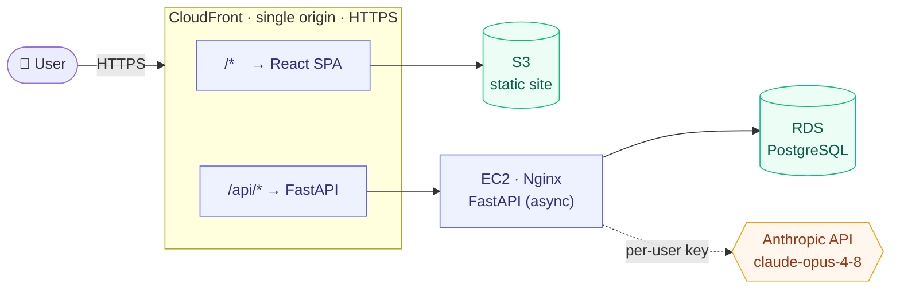

<div align="center">

# Ledger

### Know exactly where your money goes, and where it's headed.

A personal budgeting app that's actually editable, projects your savings month
by month, and benchmarks your spending against your city. Bring your own AI key
and it can fill the budget in for you.

[**Live demo**](https://d6koy70w6r2op.cloudfront.net) &nbsp;·&nbsp;
[Architecture](INFRASTRUCTURE.md) &nbsp;·&nbsp;
[Roadmap](ROADMAP.md)

`React + Vite` &nbsp; `FastAPI` &nbsp; `PostgreSQL` &nbsp; `AWS`

</div>

> [!NOTE]
> **Soft launch, active development.** The CloudFront link above is the live
> site. No custom domain yet. Expect things to move fast.

---

## What it does

|  | Feature | Notes |
|--|---------|-------|
| 📝 | **Edit everything** | Income, categories, line items. Add, rename, remove. Your leftover updates live. |
| 📈 | **Savings projections** | Compound your surplus at any APY, with a clean growth chart. Every month is editable, so month 1 can differ from month 6. |
| 📍 | **Location benchmark** | Type your city (real autocomplete) and see how your housing % and savings rate compare to cost-of-living-adjusted targets. |
| 🔐 | **Accounts** | Email + password with verified-email gate, or use it as a guest (local only). |
| 🤖 | **AI assistant** | Bring your own Anthropic key in Settings. It proposes budget edits and runs what-if projections. *(API live; chat UI is next.)* |
| 🛡️ | **Admin panel** | Usage stats and user management for admins. |

---

## How it's built



The site and its API share **one CloudFront domain**, so every call is
same-origin HTTPS: no CORS, no mixed content, one certificate.

| Layer | Tech |
|-------|------|
| **Frontend** | Vite + React 18, plain JS, inline styles, localStorage |
| **Backend** | FastAPI (async), SQLAlchemy 2.0 + asyncpg, Alembic, JWT + refresh tokens, slowapi |
| **Database** | PostgreSQL (RDS); SQLite for local dev and tests |
| **AI** | Anthropic SDK (`claude-opus-4-8`), tool use, per-user encrypted keys |
| **Hosting** | AWS us-west-2: S3 + CloudFront (web), EC2 + Nginx (API), RDS (data) |
| **CI/CD** | GitHub Actions: push to `main` builds, syncs to S3, invalidates CloudFront |

---

## Security at a glance

Built to not get hacked, and tested for it (`server/tests/test_security.py`, 25 cases).

- **SQL injection safe** - every query uses the SQLAlchemy ORM with bound
  parameters; injection payloads are treated as literal data (proven by tests
  that throw `DROP TABLE` and auth-bypass strings at it).
- **Passwords** bcrypt-hashed. **Refresh tokens** stored as SHA-256 hashes and
  rotated on use. **Per-user AI keys** encrypted at rest (Fernet), returned only
  as a masked hint.
- **Email-verification gate** - no account can obtain or use a token until a
  6-digit code is confirmed; enforced on every protected route, not just login.
- **Rate limiting** on auth and the AI route; **no stack traces** leak to clients.

---

## Run it locally

You'll run two things: the API and the web app.

### 1. Backend

```bash
cd server
python3 -m venv .venv && source .venv/bin/activate
pip install -r requirements.txt
cp .env.example .env          # set JWT_SECRET; leave DATABASE_URL blank to use SQLite
uvicorn app.main:app --reload # http://localhost:8000/docs
```

With no `DATABASE_URL`, it spins up a local SQLite file and creates the tables
automatically, so it just runs. Verification codes print to the server log
(`EMAIL_PROVIDER=console`), so you can complete signup without sending real email.

### 2. Frontend

```bash
npm install
npm run dev    # http://localhost:5173  (talks to localhost:8000)
```

That's it. Create an account, grab the code from the backend log, and you're in.

---

## Project layout

```
src/                       Frontend (Vite + React)
  main.jsx                 routes landing -> auth -> app
  Landing.jsx              public marketing page
  AuthScreen.jsx           login / register / verify-email
  auth.jsx                 auth context (tokens, guest mode)
  App.jsx                  signed-in app shell + sidebar nav
  api.js                   backend client (auto-refreshes tokens)
  useBudget.js             budget state + derived totals
  benchmarks.js            cost-of-living benchmark logic
  geo.js / LocationAutocomplete.jsx   city search + caching
  tabs/                    Budget · Savings · Settings · Admin · Help

server/                    Backend (FastAPI) - see server/README.md
  app/
    main.py                app, middleware, router wiring
    models.py              SQLAlchemy models (users, refresh_tokens,
                           email_verifications, budgets)
    db.py · store.py       engine/session + data-access layer
    security.py · crypto.py  hashing, JWT, Fernet encryption
    routers/               auth, admin, settings, budget, ai, market,
                           portfolio, accounts
    services/budget_tools.py   AI tool defs + savings projection
  alembic/                 database migrations
  tests/test_security.py   injection / auth / admin / crypto tests

.github/workflows/         CI: auto-deploy the frontend
INFRASTRUCTURE.md          live AWS architecture + server runbook
ROADMAP.md                 where this is headed
reference/                 the original hardcoded planning dashboard
```

---

## Deploying

Push to `main`. GitHub Actions builds the frontend, syncs it to S3, and
invalidates CloudFront, so changes are live in a minute or two. Backend changes
are deployed on the EC2 box (and need `alembic upgrade head` after a schema
change). The full runbook, server config, and where every secret lives are in
[INFRASTRUCTURE.md](INFRASTRUCTURE.md).

---

## Roadmap

Near-term: the AI chatbot tab, tracking actual spending vs. plan, then connecting
banks (Plaid) and investment portfolios. Longer ideas, including AI-driven
projections, live in [ROADMAP.md](ROADMAP.md).

<div align="center">
<sub>© 2026 Ledger. Built with React, FastAPI, and a lot of budgeting.</sub>
</div>
